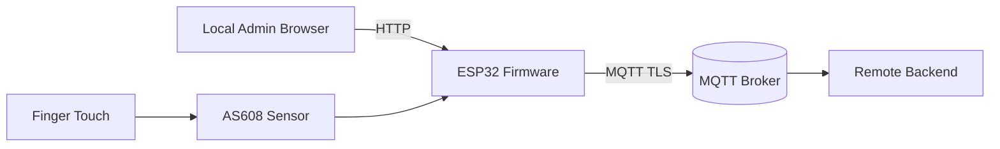
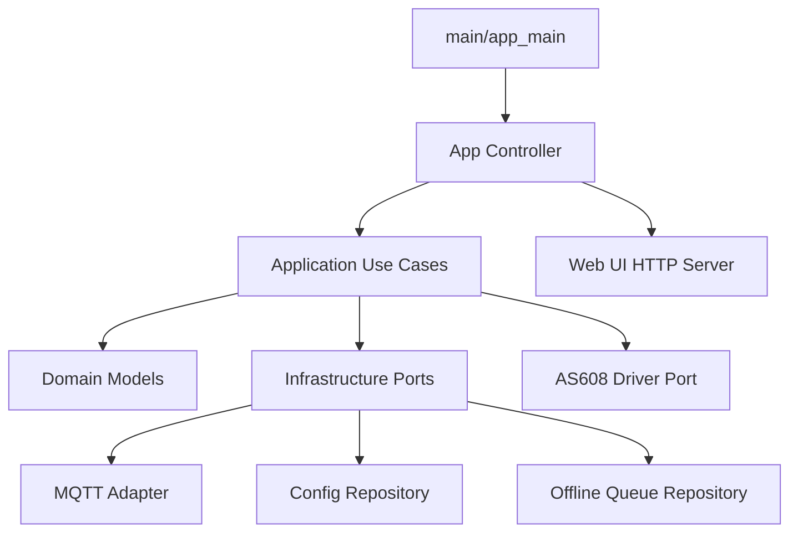

# Architecture Overview

## Goals

- Clean layered architecture suitable for production hardening
- Offline-first event delivery for check-in and registration results
- Separation of application logic from hardware-specific AS608 and ESP-IDF adapters
- Server-rendered local web UI for setup/admin workflows

## Layering

- `components/domain`: entities and core models
- `components/application`: use-case orchestration and policy
- `components/infrastructure`: MQTT, network, persistence adapters
- `components/drivers/as608`: sensor protocol wrapper
- `components/webui`: lightweight HTTP UI routes/pages
- `components/platform`: runtime mode primitives
- `main`: composition root and startup

## Runtime modes

- `INITIAL_SETUP`: device not initialized and demo mode unavailable/consumed
- `DEMO`: only before first initialization, for hardware validation
- `CONFIGURED`: normal runtime after valid configuration

## Queue design (v1 intent)

Queue items carry:
- `event_id` (for idempotency)
- event type
- fingerprint ID
- timestamp
- correlation ID
- retry count

Processing separation:
1. event generation (use cases)
2. queue storage/repository
3. queue dispatcher/replay use case

## Mermaid: system context

## Mermaid: runtime component diagram

## Future OTA note

OTA is out of scope for v1. Architecture allows adding an OTA application use case and infrastructure adapter without changing domain models significantly.
