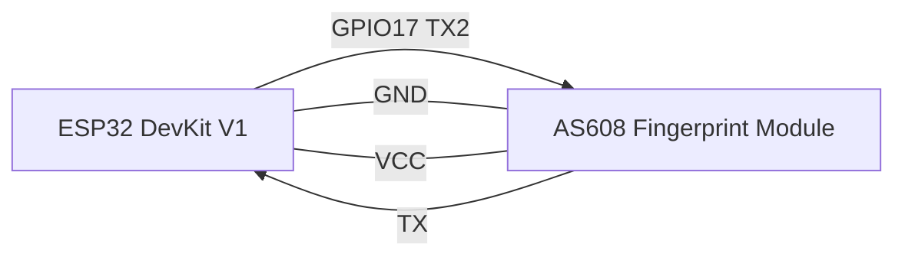

# Hardware Integration: ESP32 DevKit V1 + AS608

## Wiring assumptions (must verify against your exact AS608 module)

> **Important**: AS608 modules vary by board vendor. Verify pinout and voltage tolerance with your exact module datasheet/seller docs.

## Recommended UART mapping (ESP32)

Use UART2 default-style pins for clarity:
- ESP32 GPIO17 (TX2) -> AS608 RX
- ESP32 GPIO16 (RX2) <- AS608 TX

## Power and voltage

- ESP32 logic is 3.3V.
- Many AS608 breakout modules are powered from 3.3V-6V and expose 3.3V UART logic, but this is **not universal**.
- If AS608 TX level may exceed 3.3V, use a level shifter or resistor divider into ESP32 RX.
- Provide stable power; fingerprint sensors can draw current spikes during acquisition.

## Suggested wiring table

| ESP32 DevKit V1 | AS608 module | Notes |
|---|---|---|
| 5V (or 3V3 as supported) | VCC | Prefer module-recommended supply |
| GND | GND | Common ground mandatory |
| GPIO17 (TX2) | RX | UART TX from ESP32 |
| GPIO16 (RX2) | TX | UART RX to ESP32 |

## Mermaid wiring sketch

## Common mistakes and troubleshooting

- TX/RX swapped.
- Missing common ground.
- Wrong baud rate (AS608 often defaults to 57600, but verify).
- Inadequate power from unstable USB source.
- Using pins with conflicting bootstrapping or serial monitor wiring.

## Validation checklist

1. Confirm module voltage and UART logic level.
2. Confirm baud rate in driver config.
3. Test sensor handshake command before enrollment flow.
4. Use serial logs to inspect packet ACK/NACK responses.
