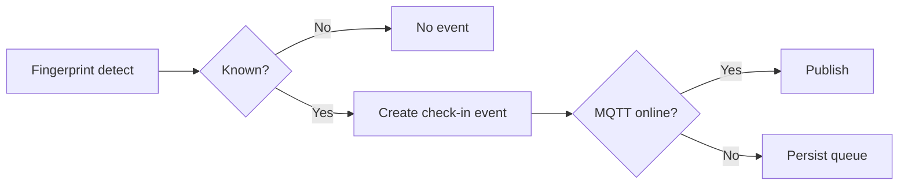

# Use Case: Check-in
## Objective
Continuously identify known fingerprints and publish check-in events.
## Actors
End user, ESP32, AS608, MQTT backend.
## Preconditions
Configured mode active; at least one fingerprint enrolled.
## Main flow
1. Poll/trigger identify.
2. Known fingerprint detected -> build check-in event.
3. Publish online or persist offline queue item.
## Alternative/error flows
Unknown fingerprint: ignored silently (no event).
## Persistence implications
Queue write when offline.
## MQTT implications
Publish on `events/checkin` with stable eventId.
## UI implications
Optional recent check-ins panel in admin page.
## Test strategy
Verify unknown finger does not emit event; offline queues.

