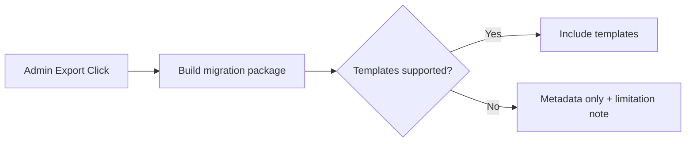

# Use Case: Export Migration Data
## Objective
Export safe configuration and fingerprint metadata; optionally templates if supported.
## Actors
Admin.
## Preconditions
Authenticated admin session.
## Main flow
1. Request export in UI.
2. Generate package (JSON + optional templates).
3. Download package.
## Alternative/error flows
Template export unsupported -> metadata-only package with explicit flag.
## Persistence implications
No direct changes unless audit logging is added.
## MQTT implications
None required.
## UI implications
Expose what is included and excluded.
## Test strategy
Verify package schema and unsupported-template signaling.

