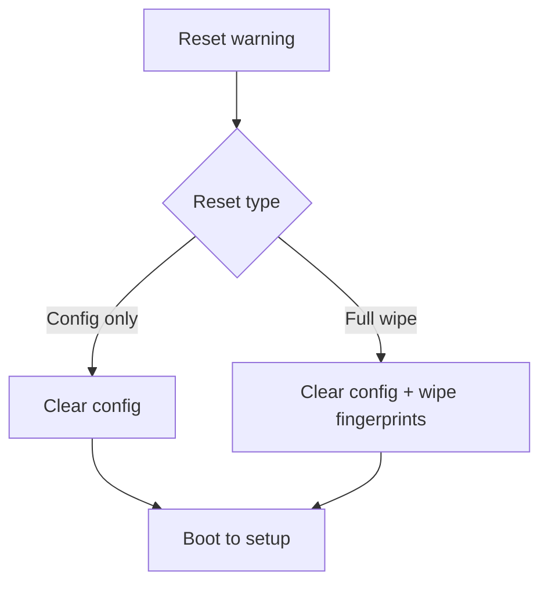

# Use Case: Factory Reset
## Objective
Reset configuration and optionally wipe sensor templates safely.
## Actors
Admin.
## Preconditions
Explicit confirmation.
## Main flow
1. Show warning + backup recommendation.
2. Select reset type: config-only or full wipe.
3. Execute reset.
4. Reboot into initial setup.
## Alternative/error flows
Sensor wipe fails -> report partial reset state.
## Persistence implications
Clears config and possibly queue; may wipe sensor DB.
## MQTT implications
Best effort final status before reset.
## UI implications
Two-step confirmation required.
## Test strategy
Verify safeguards and mode transitions.

