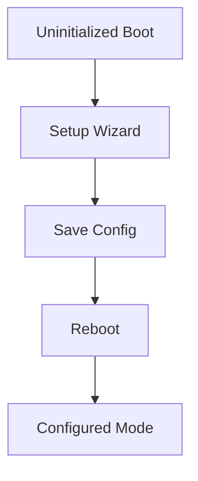

# Use Case: Initial Configuration
## Objective
Collect Wi-Fi + MQTT + identity config and persist across reboot.
## Actors
Local admin.
## Preconditions
Device not initialized.
## Main flow
1. Show setup wizard.
2. Validate form data.
3. Save config.
4. Reboot/apply runtime.
## Alternative/error flows
Validation failure -> show errors.
## Persistence implications
Persist config in NVS with versioning.
## MQTT implications
After setup, connect and publish online status.
## UI implications
Setup page hidden once initialized.
## Test strategy
Unit tests for gating and persistence flow.

