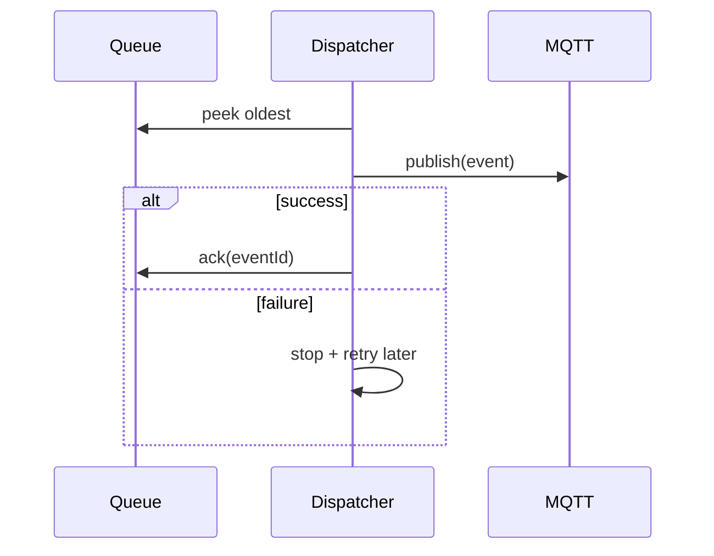

# Use Case: Offline Queue Replay
## Objective
Replay queued events when connectivity returns.
## Actors
ESP32 runtime services.
## Preconditions
Queue non-empty and MQTT connected.
## Main flow
1. Dispatcher peeks oldest event.
2. Publish event.
3. On success, ack/remove.
4. Continue up to configured batch size.
## Alternative/error flows
Publish failure -> stop and retry later with backoff.
## Persistence implications
Queue survives reboot/power loss.
## MQTT implications
At-least-once delivery; dedupe via eventId.
## UI implications
Admin page shows queue depth and oldest age.
## Test strategy
Simulate connectivity transitions and ensure no uncontrolled duplicates.

