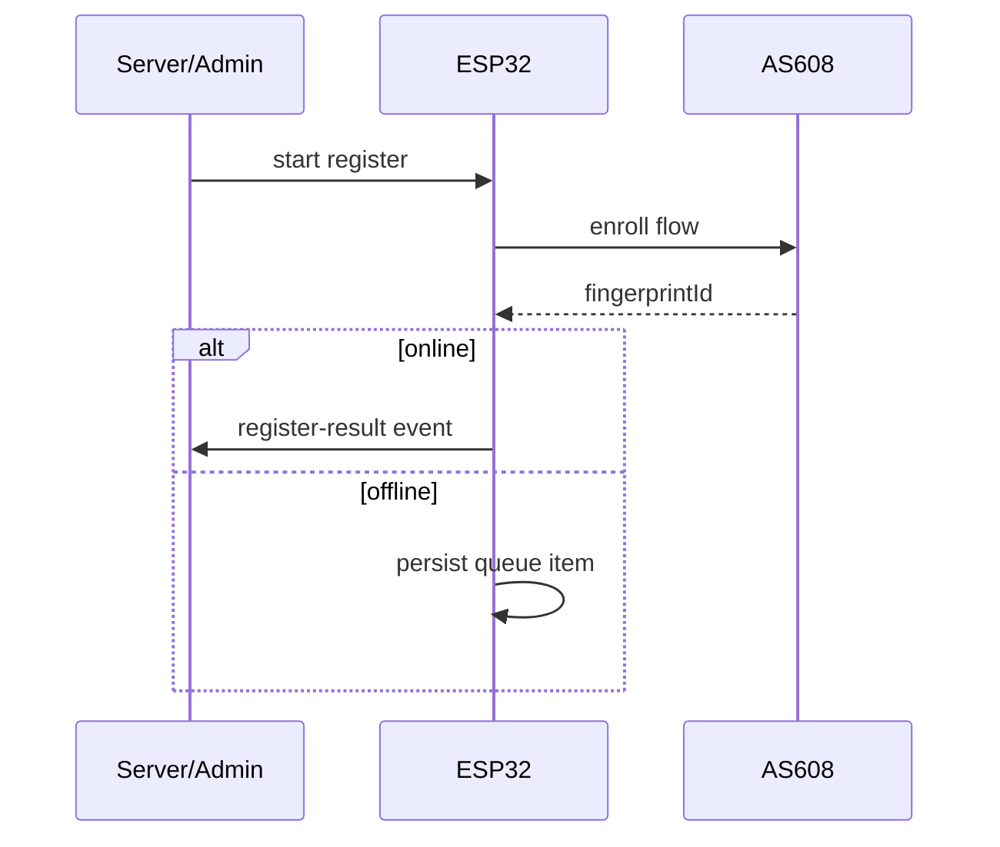

# Use Case: Register Fingerprint
## Objective
Enroll a user fingerprint and emit registration result.
## Actors
Server, local admin, end user, ESP32, AS608.
## Preconditions
Sensor reachable; free template slot; mode allows enrollment.
## Main flow
1. Remote command or local admin action starts enrollment.
2. AS608 multi-scan enrollment completes.
3. Device receives fingerprintId.
4. Publish registration result or queue when offline.
## Alternative/error flows
- Enrollment timeout/failure -> operation result failure.
- MQTT offline -> queue item persisted.
## Persistence implications
- Potential queue write for registration result.
## MQTT implications
- command correlationId reflected in result payload.
## UI implications
- Web UI should show progress and final fingerprintId.
## Test strategy
Use fake sensor (success/failure), fake MQTT online/offline assertions.

